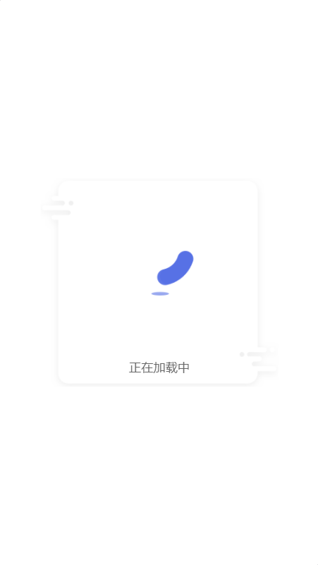
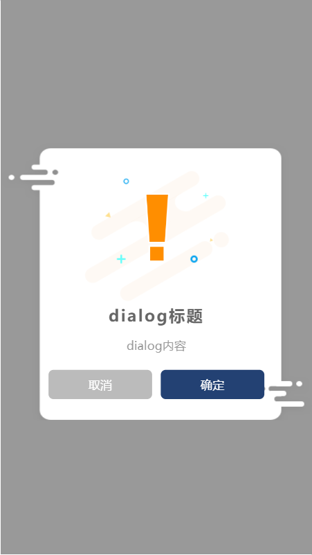

# vue 的 dialog 插件

> css 动画样式使用的 vivify 动画组件中的部分动画

## 初始化

> 从npm下载插件

``` 
npm install vue-xyh-dialog
```

> 在 main.js 进行引入并初始化

```javascript
import dialog from 'vue-xyh-dialog';

// 第二个参数传入确认按钮颜色
Vue.use(dialog, '#abcdef');
```

## showLoading(msg);

> 使用 loading 加载

| Param |  Type  | Description      |
| :---- | :----: | :--------------- |
| msg   | String | loading 提示语句 |

```vue
<template>
  <div id="app"></div>
</template>

<script>
export default {
  name: 'App',
  mounted() {
    this.$xyhDialog.showLoading('加载中');
  },
};
</script>

<style></style>
```


## hideloading();

> 隐藏 loading 动画

```vue
<template>
  <div id="app"></div>
</template>

<script>
export default {
  name: 'App',
  mounted() {
    this.$xyhDialog.showLoading('加载中');
    setTimeout(() => {
      this.$xyhDialog.hideLoading();
    }, 2000);
  },
};
</script>

<style></style>
```

## showDialog(options);

> toast 弹窗

| Param                   |      Type       | Description                                          |
| :---------------------- | :-------------: | :--------------------------------------------------- |
| {options.title}         |     String      | 标题                                                 |
| {options.msg}           |     String      | 内容                                                 |
| {options.button}        |     String      | 确认按钮文字                                         |
| {options.type}          |     Number      | 提示类型，0、info 提示 1、success 提示 2、error 提示 |
| {options.close}         | String\|Boolean | 显示取消按钮或者配置取消按钮内容                     |
| {options.duration}      |     Number      | 显示时间，单位是毫秒                                    |
| {options.callback(res)} |    Function     | 按钮点击回调，确定点击返回 true，反之返回 false      |

```vue
<template>
  <div id="app"></div>
</template>

<script>
export default {
  name: 'App',
  mounted() {
    const options = {
      title: 'dialog标题',
      msg: 'dialog内容',
      button: '确定',
      type: 0,
      close: true,
      callback(res) {
        console.log(res);
      },
    };
    this.$xyhDialog.showDialog(options);
  },
};
</script>

<style></style>
```




> 出现问题欢迎反馈至<https://github.com/xyhxx/toast>，谢谢！
> vue3版本<https://github.com/xyhxx/Vue3Plugins>
